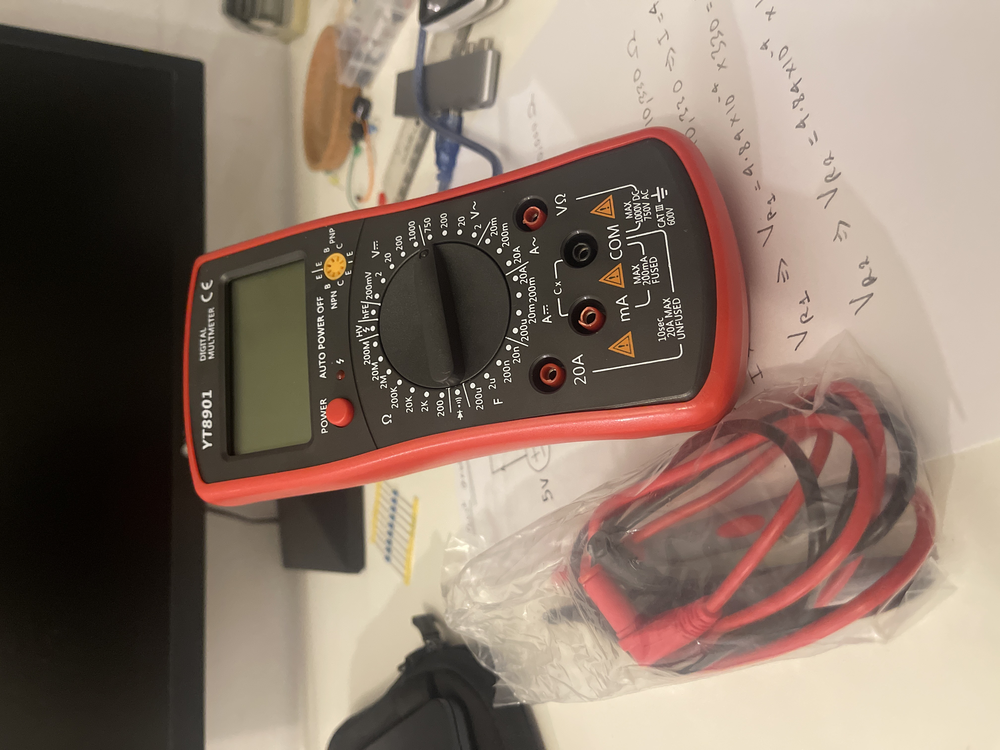
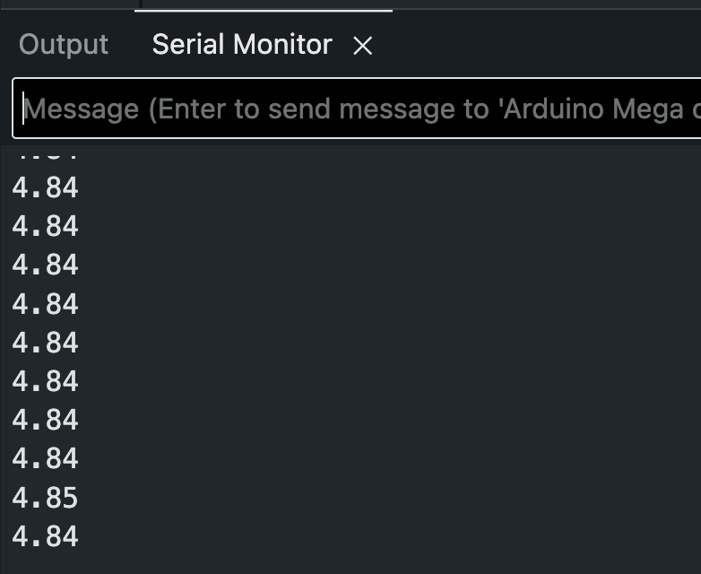

# Resistors Circuit Analysis / Potential Divider Circuit

This was my solution to an assignment from [*this lesson*](https://www.youtube.com/watch?v=5TitZmA66bI&list=PLGs0VKk2DiYw-L-RibttcvK-WBZm8WLEP&index=10) of Paul McWhorther's Arduino playlist. The aim of the project was to familiarse myself with `analogRead()` using the Arduino interface. I connected two resistors in series (a 330 Ohm, and a 10,000 Ohm resistor) and carried out circuit analysis to work out the respective voltages of the resistors using Ohm's law. I then built the circuit using an Arduino and a breadboard by following my schematic and confirmed the individual voltages of the resistors using jumper wires. 

## Key Takeaways 

- Communicating and printing using the serial monitor
- `analogRead()` (the voltage is recorded in reference to GND)
- Converting `analogRead()` to a voltage between 0 and 5 Volts
- Purchased and learnt how to use a digital multimeter
- Created a basic schematic using `KiCad`

## Images

